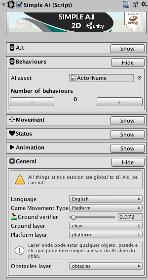
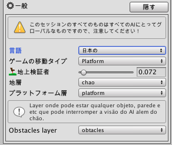
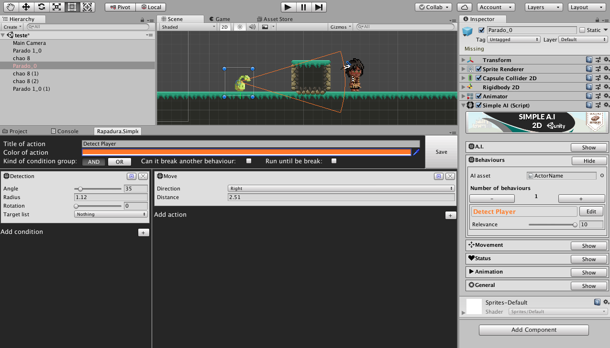
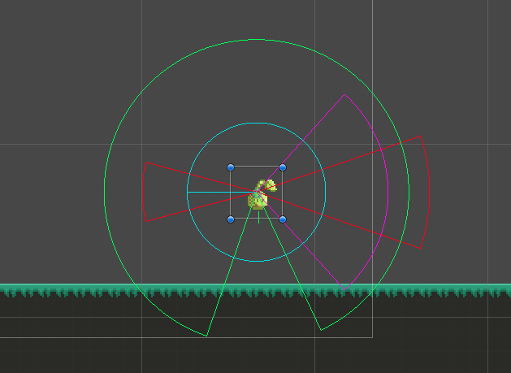

# SimpleAI 

>> Progress 3% [#...................]

Personal Weekend Project to stutie how to create tools's inteface for Unity3D.

# The idea

* The idea of this tool is to take away the complexity of writing game AIs for 2D games on Unity3D. With this tool designers, kids or anybody just trying to prototype can have faster results.

* As its objective is to be a easy tool a general configuration was implemented to switch between languages for the whole tool.

# How it works

* SimpleAI is a AI tool based in behaviours that have conditions such as detection and actions such as move or atack. It can access the animator and chnage parameters on the status machine.

* Conditions can be combined to achieve better level of complexity in terms of specification.

* As my main goal with this project is learn more about Unity3D and C# any coment such as things I wouldh'v
 done in a better way would be appreciated.

